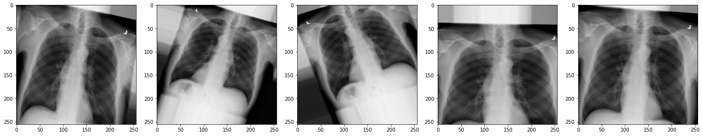

::::::::::::::::::::::::::::::::::::::: objectives

- Split the dataset into training, validation, and test sets.
- Prepare image and label arrays in the format expected by PyTorch.
- Apply basic image augmentation to increase training data diversity.
- Understand the role of data preprocessing in model generalization.

::::::::::::::::::::::::::::::::::::::::::::::::::

:::::::::::::::::::::::::::::::::::::::: questions

- Why do we divide data into training, validation, and test sets?
- What is data augmentation, and why is it useful for small datasets?
- How can random transformations help improve model performance?

::::::::::::::::::::::::::::::::::::::::::::::::::


## Partitioning the dataset

Before training our model, we must split the dataset into three subsets:

- **Training set**: Used to train the model.
- **Validation set**: Used to tune parameters and monitor for overfitting.
- **Test set**: Used for final performance evaluation.

This separation helps ensure that our model generalizes to new, unseen data.

To ensure reproducibility, we set a `random_state`, which controls the random number generator and guarantees the same split every time we run the code.

PyTorch expects image input in the format:  

`[batch_size, channels, height, width]`  

So we’ll also expand our image and label arrays to include the channel dimension at the start (grayscale images have 1 channel).


```python
from sklearn.model_selection import train_test_split

# Reshape arrays to include a channel dimension:
# [height, width] → [1, height, width]
dataset_expanded = dataset[:, np.newaxis, :, :]
labels_expanded = labels[..., np.newaxis]

# Create training and test sets (85% train, 15% test)
dataset_train, dataset_test, labels_train, labels_test = train_test_split(
    dataset_expanded, labels_expanded, test_size=0.15, random_state=42)

# Further split training set to create validation set (15% of remaining data)
dataset_train, dataset_val, labels_train, labels_val = train_test_split(
    dataset_train, labels_train, test_size=0.15, random_state=42)

print("No. images, channels, x_dim, y_dim) (No. labels, 1)\n")
print(f"Train: {dataset_train.shape}, {labels_train.shape}")
print(f"Validation: {dataset_val.shape}, {labels_val.shape}")
print(f"Test: {dataset_test.shape}, {labels_test.shape}")
```

```output
No. images, channels, x_dim, y_dim) (No. labels, 1)

Train: (505, 1, 256, 256), (505, 1)
Validation: (90, 1, 256, 256), (90, 1)
Test: (105, 1, 256, 256), (105, 1)
```

## Data Augmentation

Our dataset is small, which increases the risk of **overfitting**, when a model learns patterns specific to the training set but performs poorly on new data.

**Data augmentation** helps address this by creating modified versions of the training images on-the-fly using random transformations. This teaches the model to become more robust to variations it might encounter in real-world data.

We can use `torchvision.transforms.v2` to define the types of augmentation to apply.

```python
from torchvision.transforms import v2

# Define what kind of transformations we would like to apply
# such as rotation, crop, zoom, position shift, etc
datagen = v2.Compose([
    v2.RandomRotation(degrees=0),
    v2.RandomAffine(degrees=0, translate=(0, 0), scale=(1.0, 1.0)),
    v2.RandomHorizontalFlip(p=0.0)
])
```

:::::::::::::::::::::::::::::::::::::::  challenge

## Exercise

A) Modify the `datagen` pipeline to include one or more of the following:

- `v2.RandomRotation(degrees=20)`
- `v2.RandomResizedCrop(size=(256, 256), scale=(0.8, 1.0))`
- `v2.RandomHorizontalFlip(p=0.5)`

:::::::::::::::  solution

## Solution

A) Here's an example:

```python
datagen = v2.Compose([
    v2.RandomRotation(degrees=20),
    v2.RandomResizedCrop(size=(256, 256), scale=(0.8, 1.0)),
    v2.RandomHorizontalFlip(p=0.5)
])
```

:::::::::::::::::::::::::

::::::::::::::::::::::::::::::::::::::::::::::::::

Now let's view the effect on our X-rays!:

```python
# specify path to source data
path = os.path.join("chest_xrays")
batch_size=5

# For visualization, we'll manually apply the transforms to a few images
import torch
from PIL import Image

def plot_images(images_arr):
    fig, axes = plt.subplots(1, 5, figsize=(20,20))
    axes = axes.flatten()
    for img, ax in zip(images_arr, axes):
        # Convert tensor back to numpy for plotting
        img_np = img.squeeze().numpy()
        ax.imshow(img_np, cmap='gray')
    plt.tight_layout()
    
sample_images = [Image.open(random.choice(effusion_list)).convert('L') for _ in range(batch_size)]
augmented_images = [datagen(torchvision.transforms.v2.functional.to_image(img)) for img in sample_images]
plot_images(augmented_images)
```

{alt='X-ray augmented' width="1200px"}

:::::::::::::::::::::::::::::::::::::::  challenge

## Exercise

A) How do the new augmentations affect the appearance of the X-rays?  
Can you still tell they are chest X-rays?

:::::::::::::::  solution

## Solution

A) The augmented images may appear rotated, zoomed, or flipped.  
While they might look distorted, they remain visually recognizable as chest X-rays. These augmentations help the model generalize better to real-world variability.

In medical imaging, always consider clinical context. Some transformations, like left-right flipping, could lead to anatomically incorrect inputs if not handled carefully.

:::::::::::::::::::::::::

::::::::::::::::::::::::::::::::::::::::::::::::::

Now we have some data to work with, let's start building our model.


:::::::::::::::::::::::::::::::::::::::: keypoints

- Data should be split into separate sets for training, validation, and testing to fairly evaluate model performance.
- PyTorch expects input images in the shape (batch, channels, height, width).
- Data augmentation increases the variety of training data by applying random transformations.
- Augmented images help reduce overfitting and improve generalization to new data.

::::::::::::::::::::::::::::::::::::::::::::::::::


