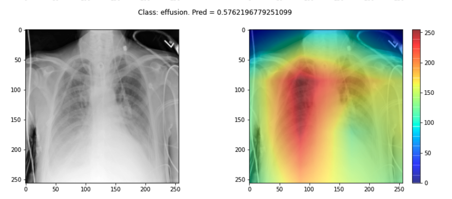
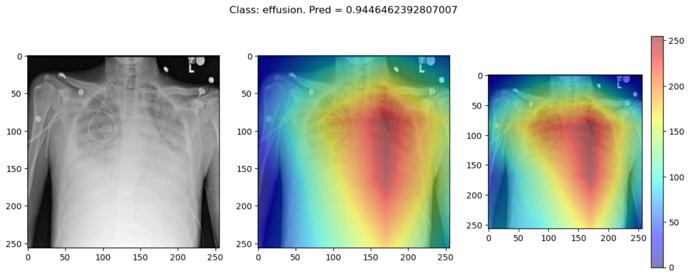
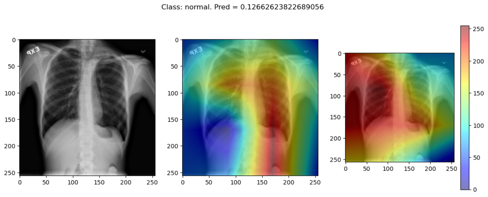

::::::::::::::::::::::::::::::::::::::: objectives

- Understand how saliency maps highlight regions that influence model predictions.
- Generate saliency maps using GradCAM++ and ScoreCAM.
- Compare explainability methods and assess their reliability.
- Reflect on the strengths and limitations of visual explanation techniques.

::::::::::::::::::::::::::::::::::::::::::::::::::


:::::::::::::::::::::::::::::::::::::::: questions

- What is a saliency map, and how is it used to explain model predictions?
- How do different explainability methods (e.g., GradCAM++ vs. ScoreCAM) compare?
- What are the limitations of saliency maps in practice?

::::::::::::::::::::::::::::::::::::::::::::::::::


## Explainability

If a model is making a prediction, many of us would like to know how the decision was reached. Saliency maps - and related approaches - are a popular form of explainability for imaging models.

Saliency maps use color to illustrate the extent to which a region of an image contributes to a given decision. Let's plot some saliency maps for our model:

```python
# !uv pip install captum
from matplotlib import cm
import numpy as np
from matplotlib import pyplot as plt
from captum.attr import LayerGradCam

# Select an explainability algorithm
# We use LayerGradCam from the Captum library
lgc = LayerGradCam(model, model.conv7)

def plot_map(cam, classe, prediction, img):
    """
    Plot the image.
    """
    fig, axes = plt.subplots(1,2, figsize=(14, 5))
    axes[0].imshow(np.squeeze(img), cmap='gray')
    axes[1].imshow(np.squeeze(img), cmap='gray')
    
    # Use Captum's built-in interpolation to upscale the 4x4 map to 256x256
    # cam must be a torch tensor for lgc.interpolate
    if isinstance(cam, np.ndarray):
        cam_tensor = torch.from_numpy(cam)
    else:
        cam_tensor = cam

    cam_interpolated = lgc.interpolate(cam_tensor, (256, 256))
    cam_agg = np.squeeze(cam_interpolated.detach().cpu().numpy())

    # Normalize to [0, 1]
    cam_min, cam_max = cam_agg.min(), cam_agg.max()
    if cam_max > cam_min:
        cam_norm = (cam_agg - cam_min) / (cam_max - cam_min)
    else:
        cam_norm = cam_agg

    heatmap = np.uint8(cm.jet(cam_norm)[..., :3] * 255)

    # TODO: try plotting cam_agg directly. Is manual normalization needed?
    # Note: alpha sets partial transparency
    i = axes[1].imshow(heatmap, cmap="jet", alpha=0.5)
    fig.colorbar(i)
    plt.suptitle("Class: {}. Pred = {:.3f}".format(classe, prediction))
    #plt.savefig(f"saliency_{random.randint(0,10000)}.png")
    #plt.close()

# Plot each image with accompanying saliency map
for image_id in range(10):
    SEED_INPUT = torch.tensor(dataset_test[image_id], dtype=torch.float32).unsqueeze(0)
    
    # Generate attribution
    # We target the output for the 'effusion' class (index 0 in binary)
    cam = lgc.attribute(SEED_INPUT, target=0)
    cam = cam.detach().cpu().numpy()
    
    # Display the class
    _class = 'normal' if labels_test[image_id] == 0 else 'effusion'
    model.eval()
    with torch.no_grad():
        _prediction = model(SEED_INPUT).item()
    
    plot_map(cam, _class, _prediction, SEED_INPUT)
```

{alt='Saliency maps' width="600px"}

:::::::::::::::::::::::::::::::::::::::  challenge

A) Choose three saliency maps from your outputs and describe:

- Where the model focused its attention
- Whether this attention seems clinically meaningful
- Any surprising or questionable results

Discuss with a partner: does the model seem to be making decisions for the right reasons?

:::::::::::::::  solution

A) You may find that some maps highlight areas around the lungs, suggesting the model is learning useful clinical features. Other maps might focus on irrelevant regions (e.g., borders or artifacts), which could suggest model overfitting or dataset biases.

Interpreting these results requires domain knowledge and critical thinking. This exercise is designed to foster discussion rather than provide a single right answer.

:::::::::::::::::::::::::

:::::::::::::::::::::::::::::::::::::::

## Sanity checks for saliency maps

While saliency maps may offer us interesting insights about regions of an image contributing to a model's output, there are suggestions that this kind of visual assessment can be misleading. For example, the following abstract is from a paper entitled "[Sanity Checks for Saliency Maps](https://arxiv.org/abs/1810.03292)":

> Saliency methods have emerged as a popular tool to highlight features in an input deemed relevant for the prediction of a learned model. Several saliency methods have been proposed, often guided by visual appeal on image data. ... Through extensive experiments we show that some existing saliency methods are independent both of the model and of the data generating process. Consequently, methods that fail the proposed tests are inadequate for tasks that are sensitive to either data or model, such as, finding outliers in the data, explaining the relationship between inputs and outputs that the model learned, and debugging the model.

There are multiple methods for producing saliency maps to explain how a particular model is making predictions. In PyTorch, the Captum library provides several implementations, including LayerGradCam and Integrated Gradients. Use this code to compare a GradCAM-based approach with a different attribution method.

```python
from captum.attr import LayerGradCam, IntegratedGradients

# Initialize two different explainability algorithms
lgc = LayerGradCam(model, model.conv7)
ig = IntegratedGradients(model)

def plot_map2(cam1, cam2, classe, prediction, img):
    """
    Plot the image.
    """
    fig, axes = plt.subplots(1, 3, figsize=(14, 5))
    axes[0].imshow(np.squeeze(img), cmap='gray')
    axes[1].imshow(np.squeeze(img), cmap='gray')
    axes[2].imshow(np.squeeze(img), cmap='gray')
    
    # Process cam1 (GradCAM) - Interpolate to match input size
    if isinstance(cam1, np.ndarray):
        cam1_tensor = torch.from_numpy(cam1)
    else:
        cam1_tensor = cam1

    cam1_interpolated = lgc.interpolate(cam1_tensor, (256, 256))
    cam1_agg = np.squeeze(cam1_interpolated.detach().cpu().numpy())
    c1_min, c1_max = cam1_agg.min(), cam1_agg.max()
    cam1_norm = (cam1_agg - c1_min) / (c1_max - c1_min) if c1_max > c1_min else cam1_agg
    heatmap1 = np.uint8(cm.jet(cam1_norm)[..., :3] * 255)

    # Process cam2 (Integrated Gradients) - Already full size
    cam2_agg = np.squeeze(cam2)
    if len(cam2_agg.shape) == 3:
        cam2_agg = np.mean(cam2_agg, axis=0)
    c2_min, c2_max = cam2_agg.min(), cam2_agg.max()
    cam2_norm = (cam2_agg - c2_min) / (c2_max - c2_min) if c2_max > c2_min else cam2_agg
    heatmap2 = np.uint8(cm.jet(cam2_norm)[..., :3] * 255)

    i = axes[1].imshow(heatmap1, cmap="jet", alpha=0.5)
    j = axes[2].imshow(heatmap2, cmap="jet", alpha=0.5)
    fig.colorbar(i)
    plt.suptitle("Class: {}. Pred = {:.3f}".format(classe, prediction))

model.eval()
# Plot each image with accompanying saliency map
for image_id in range(10):
    SEED_INPUT = torch.tensor(dataset_test[image_id], dtype=torch.float32).unsqueeze(0)
    
    # Attribution 1: LayerGradCam
    cam1 = lgc.attribute(SEED_INPUT, target=0).detach().cpu().numpy()
    
    # Attribution 2: Integrated Gradients
    cam2 = ig.attribute(SEED_INPUT, target=0).detach().cpu().numpy()
    # IG produces a map the size of the input; we average over channels for visualization
    cam2 = np.mean(cam2, axis=1) 
    
    # Display the class
    _class = 'normal' if labels_test[image_id] == 0 else 'effusion'
    with torch.no_grad():
        _prediction = model(SEED_INPUT).item()
    
    plot_map2(cam1, cam2, _class, _prediction, SEED_INPUT)
```

Some of the time these methods largely agree:

{alt='saliency\_agreement'}

But some of the time they disagree wildly:

{alt='saliency\_disagreement'}

This raises the question, should these algorithms be used at all?

This is part of a larger problem with explainability of complex models in machine learning. The generally accepted answer is to know **how your model works** and to know **how your explainability algorithm works** as well as to **understand your data**.

With these three pieces of knowledge it should be possible to identify algorithms appropriate for your task, and to understand any shortcomings in their approaches.


:::::::::::::::::::::::::::::::::::::::: keypoints

- Saliency maps visualize which parts of an image contribute most to a model’s prediction.
- GradCAM and Integrated Gradients are commonly used techniques for generating saliency maps in convolutional models.
- Saliency maps can help build trust in a model, but they may not always reflect true model behavior.
- Explainability methods should be interpreted cautiously and validated carefully.

::::::::::::::::::::::::::::::::::::::::::::::::::


