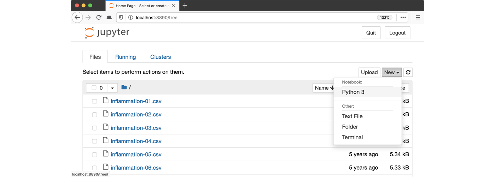

## Software Setup

All of the software and data used in this lesson are freely available online,
and instructions on how to obtain them are provided below.

## Install Python

In this lesson, we will be using Python 3 with some of its most
popular scientific libraries.
The simplest way to install Python is probably to install
the uv package manager following the instructions from ORNL-training's
lesson on [Python with uv](https://ornl-training.github.io/python-with-uv/index.html#installing-uv).


## Open a Terminal and Create a Project Directory

We will keep track of all our source code and data files in
a single "project" directory, `Desktop/src/ml-xray`.
In order to run shell commands from that directory we first
have to open a shell and navigate there.

::::::::::::::  spoiler

## Unix shell

If you're using a Unix shell application, such as Terminal app in macOS, Console or Terminal
in Linux, or [Git Bash][gitbash] on Windows, execute the following command:

```bash
cd ~/Desktop
mkdir src
cd src
uv init ml-xray
cd ~/Desktop/src/ml-xray
```

:::::::::::::::::::::::::

::::::::::::  spoiler

## Command Prompt (Windows)

On Windows, you can use its native Command Prompt program.  The easiest way to start it up is
pressing <kbd>Windows Logo Key</kbd>\+<kbd>R</kbd>, entering `cmd`, and hitting
<kbd>Return</kbd>. In the Command Prompt, use the following commands to
create your project:

```source
cd /D %userprofile%\Desktop
mkdir src
cd src
uv init ml-xray
cd /D %userprofile%\Desktop\src\ml-xray
```

:::::::::::::::::::::::::

## Download Project Package Dependencies

The major strength of Python is the number of libraries available.
These provide functionality like loading and manipulating images,
organizing and visualizing tables of data, building and training
AI/ML models etc.  This lesson is built on several Python libraries.

We can install them up-front using the following commands:

```bash
uv add pillow
uv add matplotlib
uv add numpy
uv add torch torchvision
uv add notebook # for using jupyter (recommended)
```

The [Python Package Index](https://pypi.org) hosts most python packages.
Any developer can add packages there, so it is very important to
read through and understand the package's origin, contribution history,
and developers.

Packages do not always have the same name as the
corresponding `import` source code line (e.g. `import PIL` for pillow).
Digging through available packages like this requires effort,
but not as much effort as writing the package yourself.
Often, the package's documentation is the deciding factor for how
successful and useful it will be.

When you want to progress beyond this lesson, the package
documentation and the wider set of materials written about
using these packages are the place to go.

## Obtain lesson materials

The data that we are going to use for this project consists of 700 chest X-rays. These X-rays are a subset of the public NIH ChestX-ray dataset.

> Xiaosong Wang, Yifan Peng, Le Lu, Zhiyong Lu, Mohammadhadi Bagheri, Ronald Summers, ChestX-ray8: Hospital-scale Chest X-ray Database and Benchmarks on Weakly-Supervised Classification and Localization of Common Thorax Diseases, IEEE CVPR, pp. 3462-3471, 2017

1. Download [chest\_xrays.zip](https://github.com/carpentries-incubator/machine-learning-neural-python/raw/refs/heads/main/episodes/data/chest_xrays.zip).
2. Unzip the downloaded files to `Desktop/src/ml-xray`.

After unzipping, a new folder (`chest-xrays`) should be present
in the project directory.  It has two sub-folders, each full of
png images.


## Opening a Jupyter Notebook

A Jupyter Notebook provides a browser-based interface for working with Python.
We will use notebooks in this tutorial, but it is possible for
an expert to avoid notebooks by typing code directly into
any editor (e.g. `vim main.py`) and running (`uv run main.py`).

The advantage of editing `main.py` is that you will tend to structure
your code into functions.  Ideally, functions accomplish small units
of work and have only a few variables defined.
Jupyter notebooks are good for exploring ideas, but easily become
a confusing jumble of variables (holding lots of data).
Best practice is actually to mix notebooks with python modules
(e.g. `helpers.py`, `ml-model.py`, etc.).  That way, you can
write re-usable functions in your `py` files and `import helpers`
from your Jupyter notebook.


::::::::::::  spoiler

## Unix shell

```bash
uv run jupyter notebook
```

:::::::::::::::::::::::::

:::::::::::::  spoiler

## Command Prompt (Windows)

```source
uv run python -m notebook
```
:::::::::::::::::::::::::

Launch the notebook by clicking on the "New" button on the right
and selecting "Python 3" from the drop-down menu:



[gitbash]: https://gitforwindows.org
